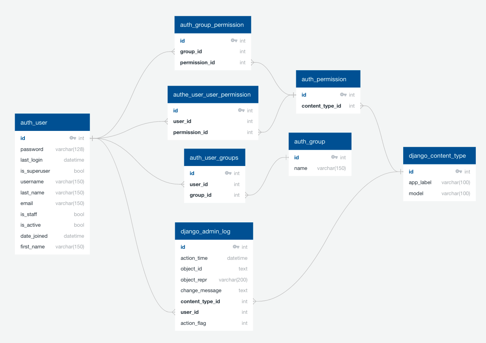
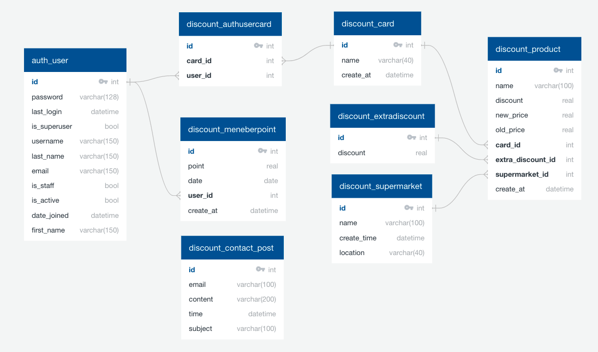
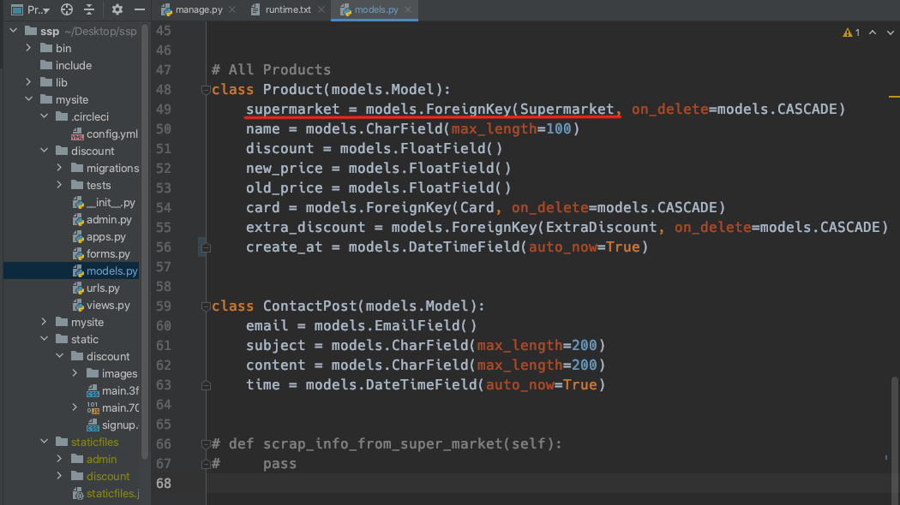
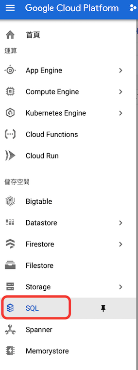
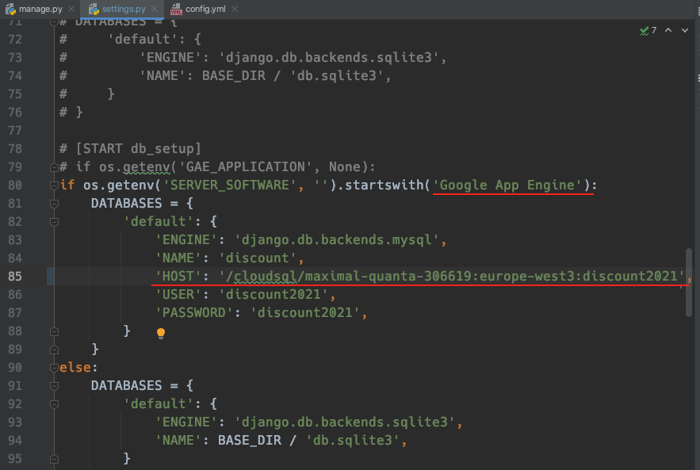

# Discounts in 1

### Links
Top area are general information of whole project, you may be interest in [Database Focus](https://github.com/RPLapple/2021discount/blob/master/README.md#database-focus) or [CI/CD Focus](https://github.com/RPLapple/2021discount/blob/master/README.md#cicd-focus).

**Target Reader** 
Anyone who interest in learning to code.

**Aim** 
To provide a simple guide to the very beginner a basic CI/CD process

**Experience level** 
Beginner (one person project)

**Softwares** 
Python, SQLite, Django, Github, CircleCI, Google Cloud Platform (GCP)

## Introduction and Overview 
Discounts in 1, is an application for gathering different weekly supermarket discounts into 1 site. It will contain the discount price and percentage information for users. If the user joins as a member, the application will provide extra functions, credit card and rewards app (e.g. payback), to help users save more money.

## The software you will use in this project 
This application developed with the below resources. There are many software and framework you can choose from, but here only provide 1 type of instruction.

**Frontend**  
we use a free template from the "Mashup Templates" website. It contains HTML, CSS, and Javascript.

**Backend**  
Django, Python's libs, is a very powerful framework, it has multifunction to help us from automated testing, database, connecting frontend and backend also to deploy to the cloud system.

**Repository**  
Github is the repository for code hosting platform for version control and collaboration.

**CI/CD**  
CircleCI, is a continuous integration and continuous delivery platform, can connect Github and automatically deploy to cloud system with pre-build software docker.

**Could system**  
Google Cloud Platform, if you want to build and run an application to reach users worldwide, or to utilize massive data storage but with elasticity capacity, without building and maintain a physical machine, to have a cloud system is a great idea.

## Development environment through version control to their production environment

**1.Different engineer working on the same project**  
Usually, a project is built by many engineers. They use the same repository to upload and merge their code for the git branching model, production, staging, and master, until the final version of the product.

**2. Github push to circleCI automatically** 
We need to set the circleCI to connect to a specific branch from the Github repository. Once the chosen branch been merged and approved, it will integrate automatically by circleCI to build and test the application. (CI, Continues integration)

**3. CircleCI deploy data to GCP storage** 
When the CI process finished, it will automatically deploy to GCP storage.

**4. Notify the post to succeed or not** 
**5. Notify build succeed or not**  
No. 4 and 5, CircleCI record each process and how much time they have used. If there's a bug, you can find error information easily.

**6. Client request browser information to API (App Engine)** 
When a user browsing a website, it will request from the cloud API (app engine), usually it should be a server to take the request, but django framework has pre-build function to connect it.

**7. API (App Engine) request data from Cloud SQL** 
After API receives the request, it will request from its database, cloud SQL.

**8. Cloud SQL provide data to API (App Engine)** 
Once the storage found the data, it will response to the API

**9. API (App Engine) provide information to client** 
API will response to the client with the final result.

  

## Database Focus
### [Principles of relational database management systems](https://en.wikipedia.org/wiki/Relational_database)  
"A relational database means each data will be stored in a field and combined into a table".(Wikipedia) After all these tables connect, it became a database. It also using a specific database language, [SQL](https://en.wikipedia.org/wiki/SQL), [The most popular SQL in 2020](https://learnsql.com/blog/most-popular-sql-databases-2020/) are Mysql, PostgreSQL, SQLite, Microsoft SQL Server. Usually, people follow [E.F. Codd’s 12 Rules for RDBMS](https://www.tutorialspoint.com/e-f-codd-s-12-rules-for-rdbms) standards to create a database.  
 
Due to this is a small project, I used pre-build database SQLite in Django. It is a light version database, already has built-in functions which suit a small and not complex project. 
 
### [Entity-relationship models](https://en.wikipedia.org/wiki/Entity–relationship_model)  
"An entity is a thing that exists either physically or logically" (Wikipedia). For example, in this project, a product physically exists, but membership is logical exists, these could be called entity. 
 

### [Database normalization and schema optimization](https://en.wikipedia.org/wiki/Database_normalization)  
"Database normalization is the process of structuring a database, by a series of so-called normal forms to reduce data redundancy and improve integrity." (Wikipedia)
In the present database, the most common normal form is 3NF. Although having a higher normal form could better bind the database, it also increases the complexity of data IO. Therefore, people tend to create functions with code to fix this issue. In this database, I tried 
- 1NF, each column has only 1 data and no repeat. 
- 2NF, meet the requirement of 1NF, move the partial dependency column to a different schema and use the Foreign Key to relate different tables. 
- 3NF, meet the requirement of 2NF, each column has no transitive dependency. 
 
 
 

### [Database indexing](https://en.wikipedia.org/wiki/Database_index)  
"Database indexing could increase the searching speed once it has Primary Key because once It has PK". (Wikipedia) [binary tree structure]([https://zhuanlan.zhihu.com/p/86189418](https://zhuanlan.zhihu.com/p/86189418)). it will turn into a binary tree structure. With a binary tree, the database will distinguish the data into different layers with a different type. This will help to reduce the searching times as the red path in the picture.
 
 

### [Object-relational mapper(ORM)frameworks](https://en.wikipedia.org/wiki/Object%E2%80%93relational_mapping). 
"An ORM framework is a programming technique for converting data between incompatible type systems using object-oriented programming languages. It can hide the SQL into its logic, you only need to use simple language but can create the same table in the database." (Wikipedia) For example, Django is an ORM framework, if you want to create a product table in the database and contains a supermarket (FK), you only need to go to `models.py` and put 
 
`class Product(model.Model): ` 
       `supermarket = models.ForeignKey(Supermarket, on_delete=models.CASCADE)`  
But you can still execute SQL through the command-line interface, shell.  
 
 
 

### Securing a databse
For the Securing a database, in this project, I focused on the admin and member's side of using the database. I used Django pre-build authentication and authorization system, in which only authorized superusers can revise the product data and authorized users can see the full product information. For example,  

 

You can create users in the CLI or the admin site to adjust their authorities.  

If we dig deeper about securing a database, it will expand to, such as when we receive a message from customer feedback on the contact page. To prevent this type of possibility, in the Django framework, they have a special function on the frontend website ``, which is to send a specific token to the user and renew it after a certain time, so that if someone wants to log in but can't provide this token, the server would ignore this requirement. 
 

### Database backup strategies
For this project, I used `git` as my backup strategy. Because every time when I record my working status, I used `git add .`  and `git commit -m 'xxx' ` for all files. If I want to go back to a specific time, I could check the description and find the right time. But this is because SQLite is already a build-in system in Django, which could update very easily.  
 
In a more complex project, we might need to consider: 
- How often should we backup our database?  
- Should we backup everything or just a part of it?  
- Where should we have our backup?  
 
For example, in this project, may not increase the number of members very often, do we need to back up this part every day? Do we need to back up the discount from last week? No.  
 

## CI/CD Focus

### How to connect to the GCP DB  
1. Connect to the DB, create an instance in GCP SQL, it may ask you to permit API.  
2. Select a suitable database zone  
  
3. Add the instance ID to setting.py (Django file)  

  

### How to connect to GCP  
1. To get the key from GCP
→ IAM & Admin → Service Account → Action → Manage Keys → Add Key  
  

2. Download the json file, copy the data and past into circleCI 
  

3. Enable the App Engine Admin API, so it got the permission to start.  
  

4. Push the code to github again, and circleCI will build, test and deploy again. 
  

5. Back to the CLI and run the gcloud. [How to change the project in GCP using CLI commands](https://ppt.cc/fFjzVx) 
Here fails was because I used another testing GCP account, but I changed to our university account now. For how to revise the data, we need to run 2 commands: 
`gcloud config set project projectID` and `gcloud components update` 
  

6. Because here has an error said, that we need to make sure our email address has the [App Engine Deployer](https://ppt.cc/f3j7Px) role, so we need to back to IAM & Admin and set the permission.  
run `gcloud app deploy` again, everything went well and we can link to the target url. 
  
  

7. Here is the [final page](https://maximal-quanta-306619.ey.r.appspot.com/). 
  
