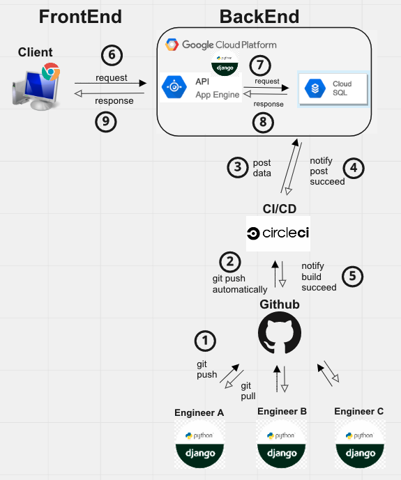
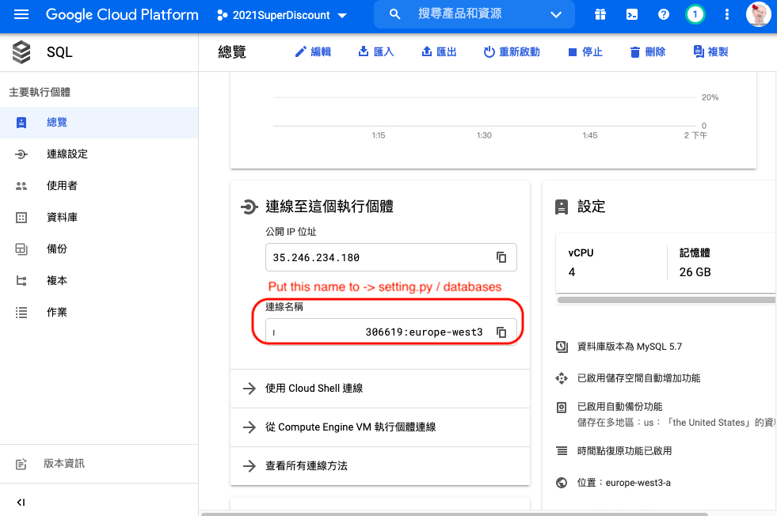

# Discounts in 1

### Links
Top area are general information of whole project, you may be interest in [Database Focus](https://github.com/RPLapple/2021discount/blob/master/README.md#database-focus) or [CI/CD Focus](https://github.com/RPLapple/2021discount/blob/master/README.md#cicd-focus).

**Target Reader** 
Anyone who interest in learning to code.

**Aim** 
To provide a simple guide to the very beginner a basic CI/CD process

**Experience level** 
Beginner (one person project)

**Softwares** 
Python, SQLite, Django, Github, CircleCI, Google Cloud Platform (GCP)

## Introduction and Overview 
Discounts in 1, is an application for gathering different weekly supermarket discounts into 1 site. It will contain the discount price and percentage information for users. If the user joins as a member, the application will provide extra functions, credit card and rewards app (e.g. payback), to help users save more money.

## The software you will use in this project 
This application developed with the below resources. There are many software and framework you can choose from, but here only provide 1 type of instruction.

**Frontend**  
we use a free template from the "Mashup Templates" website. It contains HTML, CSS, and Javascript.

**Backend**  
Django, Python's libs, is a very powerful framework, it has multifunction to help us from automated testing, database, connecting frontend and backend also to deploy to the cloud system.

**Repository**  
Github is the repository for code hosting platform for version control and collaboration.

**CI/CD**  
CircleCI, is a continuous integration and continuous delivery platform, can connect Github and automatically deploy to cloud system with pre-build software docker.

**Could system**  
Google Cloud Platform, if you want to build and run an application to reach users worldwide, or to utilize massive data storage but with elasticity capacity, without building and maintain a physical machine, to have a cloud system is a great idea.

## Development environment through version control to their production environment

**1.Different engineer working on the same project**  
Usually, a project is built by many engineers. They use the same repository to upload and merge their code for the git branching model, production, staging, and master, until the final version of the product.

**2. Github push to circleCI automatically** 
We need to set the circleCI to connect to a specific branch from the Github repository. Once the chosen branch been merged and approved, it will integrate automatically by circleCI to build and test the application. (CI, Continues integration)

**3. CircleCI deploy data to GCP storage** 
When the CI process finished, it will automatically deploy to GCP storage.

**4. Notify the post to succeed or not** 
**5. Notify build succeed or not**  
No. 4 and 5, CircleCI record each process and how much time they have used. If there's a bug, you can find error information easily.

**6. Client request browser information to API (App Engine)** 
When a user browsing a website, it will request from the cloud API (app engine), usually it should be a server to take the request, but django framework has pre-build function to connect it.

**7. API (App Engine) request data from Cloud SQL** 
After API receives the request, it will request from its database, cloud SQL.

**8. Cloud SQL provide data to API (App Engine)** 
Once the storage found the data, it will response to the API

**9. API (App Engine) provide information to client** 
API will response to the client with the final result.

## Database Focus

## CI/CD Focus

1. Connect to the DB, create a instance in GCP SQL, it may ask you to give a permission on API.  
2. Select a suitable database zone

 
3. Add the instance ID to setting.py (Django file) 

 
